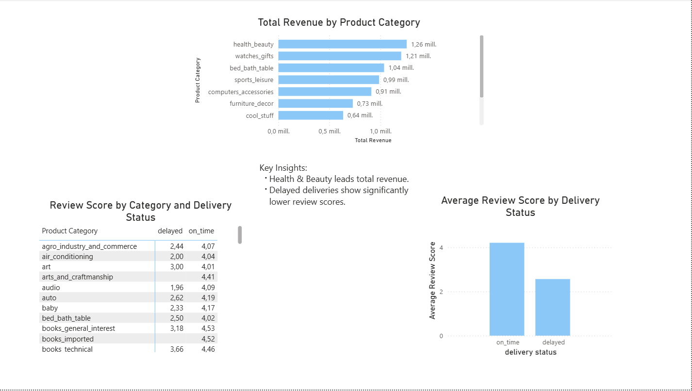

# Brazilian E-commerce SQL Analysis (Olist)

## Project Overview
This project analyzes the Brazilian E-commerce Public Dataset by Olist using SQL, Python, and Power BI. The goal is to transform raw relational data into business insights focused on revenue, delivery performance, and customer satisfaction.

The project combines data loading, SQL analysis, and dashboard storytelling to answer relevant business questions through a clear analytical workflow.

## Dataset
The analysis is based on the Olist public e-commerce dataset, which includes information about orders, order items, products, payments, reviews, customers, sellers, and geolocation.

## Dataset Characteristics
- Around 100k orders
- Multiple related tables covering sales, products, reviews, payments, customers, sellers, and logistics
- Time range: 2016–2018

Raw CSV files are stored locally and are not included in this repository.

To run this project, place the original files in:

`data/raw/`

## Business Questions
This project focuses on three main analytical questions:

- What product categories generate the highest total revenue?
- How does delivery delay impact customer reviews across product categories?
- What is the relationship between delivery delay and review scores overall?

## Key Insights
- **Health & Beauty** is the top revenue-generating product category in the dataset.
- **Delayed deliveries** are associated with significantly lower review scores than on-time deliveries.
- The negative effect of delivery delays appears across multiple product categories.

## Project Structure
- `dashboards/` → Power BI dashboard files
- `data/raw/` → original local CSV files (not tracked in the repository)
- `notebooks/` → Jupyter notebooks for data loading
- `sql/` → SQL scripts for setup, validation, preparation, and analysis
- `.gitignore` → ignored local files
- `README.md` → project documentation

## Tech Stack
- SQL
- MySQL
- Power BI
- Python
- Pandas
- SQLAlchemy
- PyMySQL
- Jupyter Notebook

## Workflow
1. Load raw CSV files into MySQL using Python
2. Validate table structure and key relationships
3. Create SQL queries and views to answer business questions
4. Connect Power BI to MySQL through ODBC
5. Build a dashboard based on SQL outputs

## Dashboard Focus
The final dashboard includes three core views:
- **Total Revenue by Product Category**
- **Review Score by Category and Delivery Status**
- **Average Review Score by Delivery Status**

## Why This Project
This project was designed as a portfolio piece to demonstrate:
- SQL querying and joins
- Data validation and relational thinking
- Business-oriented analysis
- Clear communication of insights through dashboards

## Future Improvements
Possible next steps include:
- Expanding the analysis with geolocation-based insights
- Refining naming conventions through cleaner SQL views and aliases
- Enhancing the dashboard with dynamic KPI cards and layout improvements

