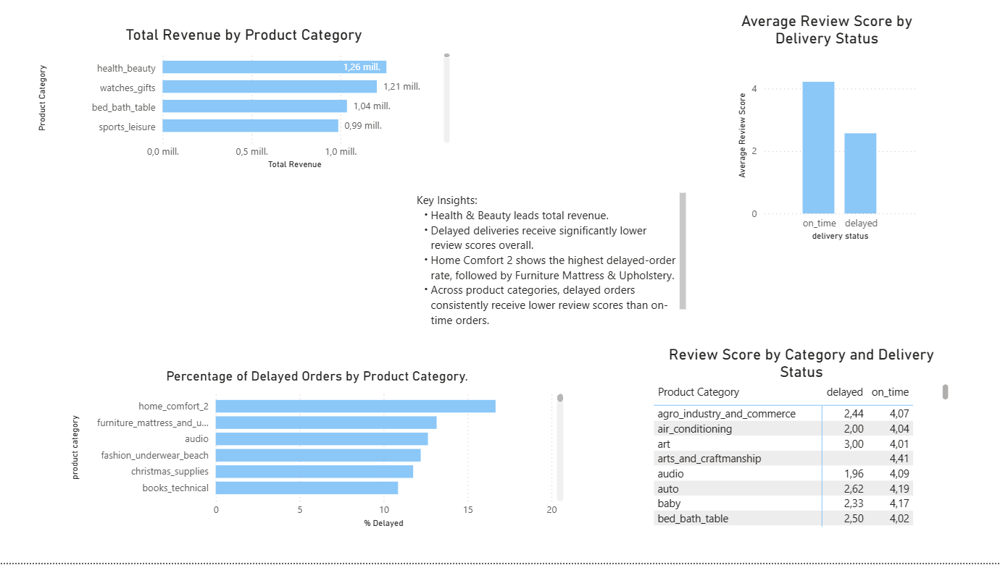

# Brazilian E-commerce SQL Analysis (Olist)

## Project Overview
This project analyzes the Brazilian E-commerce Public Dataset by Olist using SQL, Python, and Power BI. The goal is to transform raw relational data into business insights focused on revenue, delivery performance, and customer satisfaction.

The project combines data loading, SQL analysis, and dashboard storytelling to answer relevant business questions through a clear analytical workflow.

## Dataset
The analysis is based on the Olist public e-commerce dataset, which includes information about orders, order items, products, payments, reviews, customers, sellers, and geolocation.

## Dataset Characteristics
- Around 100k orders
- Multiple related tables covering sales, products, reviews, payments, customers, sellers, and logistics
- Time range: 2016–2018

Raw CSV files are stored locally and are not included in this repository.

To run this project, place the original files in:

`data/raw/`

## Business Questions
This project focuses on four main analytical questions:

- What product categories generate the highest total revenue?
- What is the relationship between delivery delay and review scores overall?
- How does delivery delay impact customer reviews across product categories?
- How do delivery delays vary across product categories?

## Key Insights
- **Health & Beauty** is the top revenue-generating product category in the dataset.
- **Delayed deliveries** are associated with significantly lower review scores than on-time deliveries.
- **Home Comfort** shows the highest delayed-order rate, followed by **Furniture Mattress & Upholstery**.
- The negative effect of delivery delays appears consistently across product categories.

## Project Structure
- `dashboards/` → Power BI files and exports
- `data/processed/` → cleaned datasets ready for analysis
- `data/raw/` → original data (not tracked)
- `notebooks/` → data loading and EDA (Python)
- `sql/` → setup, validation, preparation, and analysis queries
- `README.md` → documentation

## Data Model

Olist is not a flat dataset. Information is distributed across distinct entities — orders, customers, products, payments, reviews, sellers, and geolocation — each at a different level of detail.

The relational model was the right approach for the SQL layer because:
- It avoids duplicating data and mixing metrics across different granularities
- It reflects the actual business relationships between entities
- It enables coherent JOINs without inflating row counts or breaking aggregation logic

`orders` is the central bridge table. From it you connect customers, items, payments, and reviews. From `order_items` you reach products and sellers. This structure makes it possible to analyze revenue, delivery delays, and review scores at the correct grain — without double-counting or misattributing metrics.

In Power BI, each analytical view (`top_categories`, `delivery_by_category`, `category_reviews`, `review_scores`) answers an independent business question and is loaded as a standalone table. Only `delivery_by_category` and `top_categories` share a 1:1 relationship via `product_category_name_english` to enable cross-filtering by category in the dashboard.

---

## Tech Stack
SQL · MySQL · Power BI · Python · Pandas · SQLAlchemy · PyMySQL · Jupyter

## Workflow
Data ingestion → validation → SQL analysis → visualization

1. Load cleaned CSVs into MySQL (Python + SQLAlchemy)  
2. Validate schema, keys, and data integrity  
3. Prepare data with SQL transformations  
4. Analyze with SQL queries focused on business questions  
5. Build dashboard in Power BI connected to MySQL  

## Key Analysis
- Revenue distribution by product category  
- Impact of delivery performance on customer reviews  
- Relationship between category and satisfaction  
- Operational insight: delayed orders by category  

## Dashboard
Designed to support business decision-making with:
- Clear KPI-focused visuals  
- Category-level comparisons  
- Delivery performance insights  
- Customer satisfaction patterns  

## What This Demonstrates
- Strong SQL fundamentals (joins, aggregations, filtering)  
- Relational thinking and data validation  
- Ability to structure an end-to-end data project  
- Translation of data into business insights  

## Next Steps
- Incorporate geolocation analysis (ZIP code)  
- Improve SQL modularization (views, naming)  
- Add advanced KPIs and storytelling in Power BI  
- Extend analysis to customer segmentation and payments  

Data Analyst
Ela Ruiz